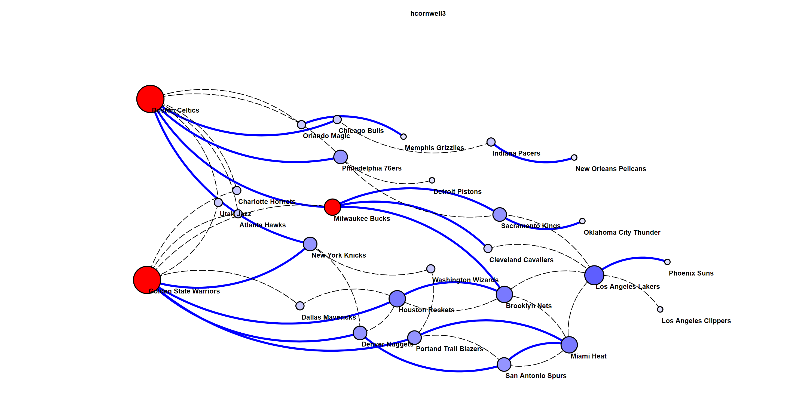
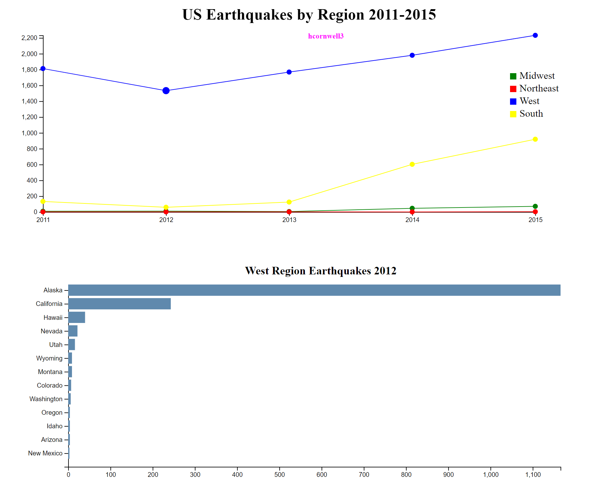
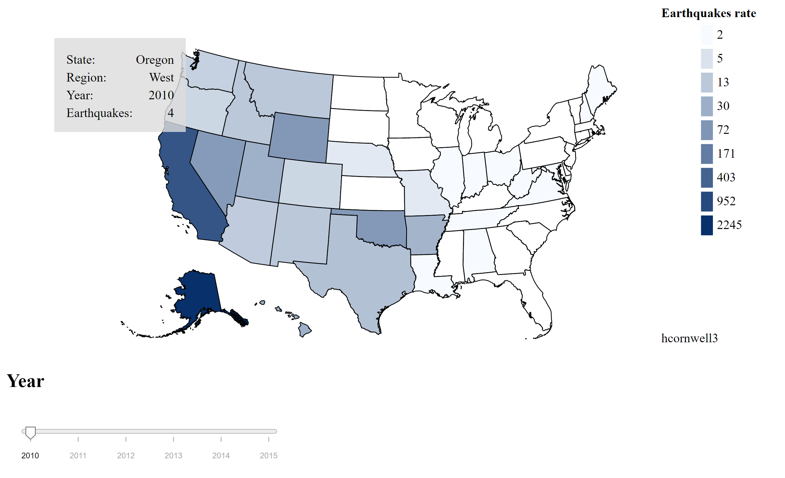
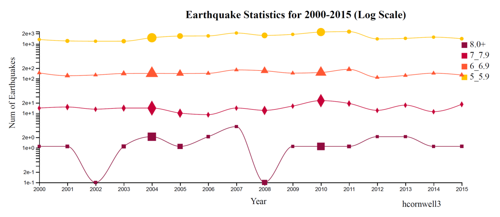

# Data-Visualization-Results
For the class Data Visualization, there was an assignment for D3 visualizations. These charts, graphs, and maps are all shown here. The core code needed to be hidden since there can be potential plagiarism for future classes. However, I kept the main file stucture and took screenshots of the visualizations to showcase the different types of graphs that can be made with D3.

## Preview of some of the Results

Interactive graphs where nodes can be pinned and highlighted.

Interactive line chart that shows a bar chart of the specific data point when the mouse hovers over.

Interactive map on a color scale that changes by year through a slider at the bottom.

Line chart with scaled markers based on the dataset.

